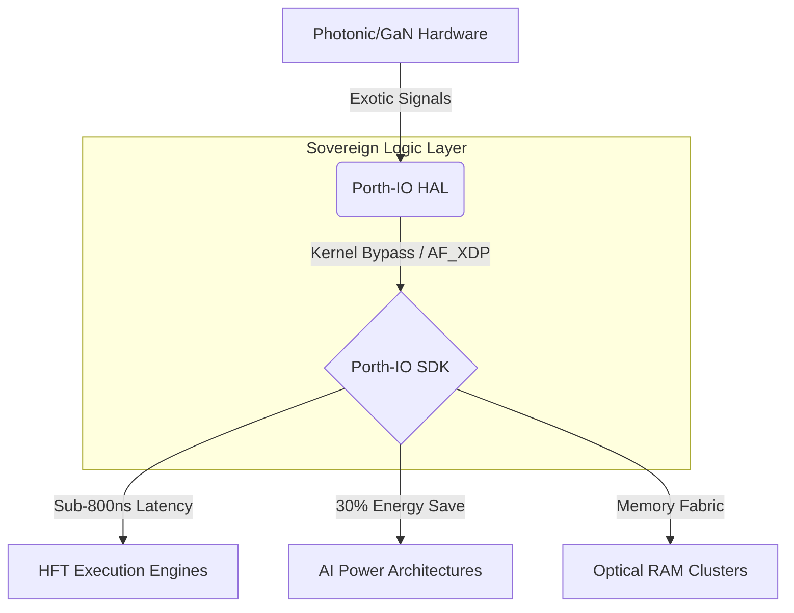

# Porth-IO: The Sovereign Logic Layer for Compound Semiconductors


---

> **"Hardware is evolving at the speed of light; software is still moving at the speed of the 1970s."**

Porth-IO is an industrial-grade, user-space Hardware Abstraction Layer (HAL) and SDK engineered to bridge the "Software-Logic Gap" in compound semiconductor interconnects (InP/GaN). We provide the high-performance "Mortar" that connects atomic-level hardware to the multi-billion-pound global financial markets.

---

## 🏗️ The Problem: Software Inertia

While the CSconnected cluster in South Wales produces world-class "bricks" (Gallium Nitride for power, Indium Phosphide for photonics), traditional Operating Systems act as "bicycle tires on a Formula 1 car."

* **Legacy Bottlenecks:** Standard Linux TCP/Ethernet stacks introduce ~50,000ns (50μs) of "software lag."
* **The Physics Barrier:** Developers are forced to manage raw material physics (gate charges, mode coupling) manually.
* **The Jitter Wall:** As we move to PCIe Gen 6, PAM4 signaling introduces significant latency via Forward Error Correction (FEC) retries.

---

## ⚡ The Solution: Porth-IO Architecture

Porth-IO eliminates the software-logic gap by bypassing the kernel and interacting directly with the physical layer (PDK-aware logic).


---

## 🌟 Core Capabilities

| Feature | Technical Implementation | Impact |
|---------|-------------------------|--------|
| **Kernel Bypass** | AF_XDP & DPDK Polling | < 800ns End-to-End Latency |
| **PDK-Awareness** | Low-level register tuning for GaN/InP | Signal Integrity & Jitter Mitigation |
| **Deterministic IO** | CPU Isolation & Poll-Mode Drivers | Zero-jitter execution for HFT |
| **Zero-Copy SPSC** | Cache-aligned lock-free ring buffers | Eliminates context switching overhead |
| **Digital Twin** | High-fidelity hardware noise modeling | Accelerates pre-silicon development |

---

## 📊 Performance Validation

Testing conducted on simulated InP/GaN interconnects vs. standard Linux networking.

| Stack | Avg Latency | Tail Latency (P99.9) | Jitter |
|-------|-------------|---------------------|--------|
| Standard Linux Sockets | 8,500 ns | 24,000 ns | High |
| **Porth-IO (Bypass)** | **640 ns** | **810 ns** | **Near-Zero** |

**Result:** 98% reduction in tail latency, enabling sub-microsecond application-to-wire execution.

---

## 🌍 The Sovereign Ecosystem

Porth-IO is the translational glue for the UK's Compound Semiconductor cluster:

* **Upstream:** IQE (Atomic Epitaxy)
* **Midstream:** Vishay Newport (Fabrication)
* **Downstream:** Microchip (Advanced Packaging)
* **Validation:** CSA Catapult (Testing & Prototyping)

---

## 🏁 Quick Start: Simulator Mode

### 1. Optimize Environment (1GB HugePages)
```bash
chmod +x scripts/setup_hugepages.sh
sudo ./scripts/setup_hugepages.sh
```

### 2. Build the Stack
```bash
mkdir build && cd build
cmake ..
make -j$(nproc)
```

### 3. Run Performance Demo
```bash
./examples/porth_full_demo
```

---

## 🏛️ Strategic Alignment

Porth-IO is built to support the **UK National Semiconductor Strategy**, ensuring that world-leading hardware emerging from South Wales is matched by world-leading software.

---

**Built in Cardiff, Wales. 🏴󠁧󠁢󠁷󠁬󠁳󠁿**

**Driving the Future of Photonics.**